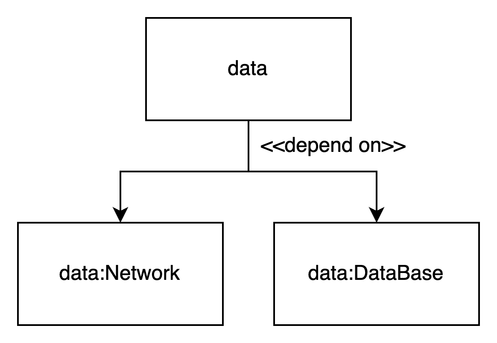
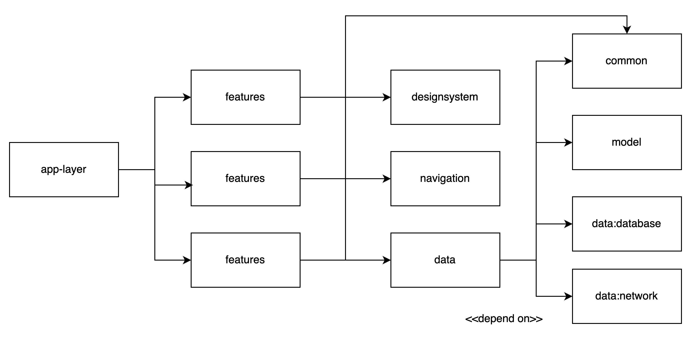

# flutter_base_source

Base Soure Code Flutter adapt multi-features

## Getting Started
At root project, run command to sync dependency
```
run flutter pub get
```
Move to `data/data_network` and run below command to generate data class
```
cd data/data_network

flutter pub run build_runner build
```
### Data Layer
External modules do not call directly DataBase/NetworkAPI,will work through data Module 

<p align="center">
  
</p>

### Features Layer

<p align="center">
  
</p>


## License
```
Copyright 2022 baka3k
I am providing code and resources in this repository to you under an open source license.  Because this is my personal repository, the license you receive to my code and resources is from me and not my employer.*
```
